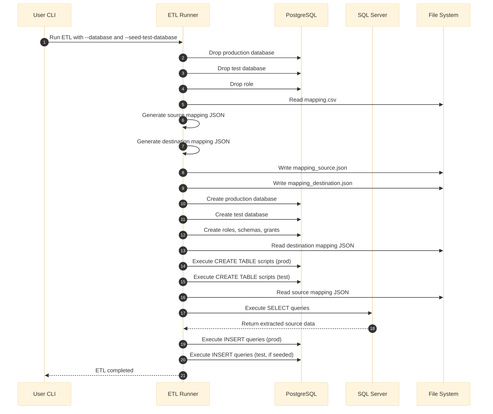

# Cross-Platform ETL Pipeline: SQL Server to PostgreSQL Migration

<div align="center">

[](https://www.python.org/) [](https://learn.microsoft.com/en-us/sql/sql-server/what-s-new-in-sql-server-2022?view=sql-server-ver17) [](https://www.postgresql.org/) [](https://pdm.fming.dev)
</div>

This repository contains a modular ETL framework for provisioning PostgreSQL databases, extracting data from SQL Server, and loading structured mappings using JSON and CSV assets.



The ETL pipeline processes data across 35 distinct tables, resulting in a total of 485,625 rows extracted, transformed, and loaded into the destination system. The volume reflects a moderately complex schema with substantial row-level operations, suitable for analytics, reporting, or downstream integration.

|Stat|Count|
|---|---|
|Total Number of Tables|35|
|Total Number of Rows|485,625|

Each module is documented using reStructuredText (reST) to promote contributor onboarding.

---

## 📦 Packages

| Domain            | Package           | Minimum Version |
|------------------|-------------------|-----------------|
| Database Drivers | psycopg2          | 2.9.10          |
|                  | pyodbc            | 5.2.0           |
| Environment      | python-decouple   | 3.8             |
|                  | python-dotenv     | 1.1.1           |
| CLI Utilities    | argparse          | 1.4.0           |
| Data Processing  | pandas            | 2.3.3           |
| Code Formatting  | black             | 25.9.0          |

## 📋 Module Overview

### Logging Configuration
- Sets up file and console logging using `logging` and `python-decouple`.
- Formats include timestamps, log levels, and module names.

### Validation Utilities
- `validate_list(name, list)` checks for non-empty lists and logs warnings.
- Used across extract/load modules for precondition checks.

### File Handling Utilities
- JSON and query file readers:
  - `read_json_file`, `load_json_file`, `read_query_from_file`
- Query mapping extractor:
  - `get_query_list_from_file`

### Mapping Data Utilities
- Reads and filters mapping CSVs for source/destination tables.
- Writes mapping data to JSON.

---

## 🛠️ Database Operations

### PostgreSQL Execution
- `execute_pg_query`: Executes raw or batch queries with rollback and logging.
- `set_pg_connection`: Connects using environment credentials.

### PostgreSQL Provisioning
- `build_pg_database`: Creates database, roles, schemas, and grants.
- `drop_pg_database`, `drop_pg_role`: Teardown utilities.
- `pg_build`: Executes templated SQL files with variable substitution.

### SQL Server Execution
- `execute_sql_query`: Connects via ODBC, executes query, returns row data.

---

## 🔄 ETL Workflow Modules

### Extract
- `get_source_data`: Reads source mapping and extracts data from SQL Server.

The extract module retrieves structured data from SQL Server using parameterized SELECT queries that target transactional tables. 

- Each query must align with PostgreSQL schema constraints, including data types, nullability, and referential integrity.
- Extracted data is returned as a list of tuples, each containing a table ID and its associated row set.
- The module includes validation logic (`validate_list`) to ensure that the result set is non-empty before proceeding to the load phase.
- The extract logic is tightly integrated with logging modules to capture query execution status, warnings for empty results, and errors for missing files or failed connections.
- It supports modular query file loading via `read_query_from_file`, allowing for dynamic query substitution and reuse across environments.

Here's an overview of their complexity and operational design:

- The SELECT statement include identifiers, dates, flags, monetary values, and foreign keys.
- Several fields are explicitly cast or converted to ensure compatibility with downstream PostgreSQL schemas:
  - Date fields are converted to ISO 8601 string format using `CONVERT(VARCHAR, ..., 120)`.
  - Boolean flags are cast to CHAR(1) for consistent representation.
  - Monetary fields are cast to `DECIMAL(18,2)` to enforce precision.
  - GUIDs (`rowguid`) are converted to string format for UUID compatibility.

These extract modules are built for reliability, schema alignment, and transformation readiness. They serve as a bridge between SQL Server’s native formats and PostgreSQL’s structured schema, ensuring that each row is cleanly cast, validated, and ready for downstream loading.

### Load
- `insert_pg_tables`: Loads extracted data into PostgreSQL using insert mappings.

The PostgreSQL table insertion scripts demonstrates a high degree of operational and structural complexity, reflecting the demands of a transactional sales system with strict data integrity and controlled identity management.

Here's an overview of its key characteristics:

- Insertions spans multiple domains: identifiers, dates, flags, monetary values, foreign keys, and audit fields.
- Includes both nullable and non-nullable fields, requiring precise data validation and ordering.
- Uses the clause `OVERRIDING SYSTEM VALUE`, which allows explicit insertion of values into an identity column for migration.
- The inserted fields align with a schema that enforces multiple foreign key relationships, meaning each insert must respect referential integrity constraints.
- Monetary fields have check constraints ensuring non-negative values.
- Temporal fields conform to logical sequencing enforced by schema-level checks.
- The use of parameterized placeholders (%s) support integration with psycopg2.

This insertion pattern is typical of a production-grade ETL or migration pipeline, where data fidelity, referential integrity, and controlled overrides are essential.

### Create
- `create_pg_tables`: Executes `CREATE TABLE` scripts from destination mappings.

The creation of the PostgreSQL tables reflects a high level of schema complexity, designed to support a transactional sales system with robust referential integrity, computed fields, and performance-optimized indexing. 

Here's an overview of its structural and relational sophistication:

- Tables are created with `IF NOT EXISTS` to support idempotent deployment.
- Includes diverse data types: integers, decimals, timestamps, UUIDs, bit flags, and character varying fields.
- Uses identity-based primary key generation for primary keys, ensuring uniqueness and scalability.
- Implements computed columns which dynamically generates values using a stored expression.
- Applies default values to key operational fields, supporting consistent insert behavior.
- Establishes B-tree indexes to optimize query performance across key dimensions.

This schema is representative of a production-grade OLTP design, balancing normalization, constraint enforcement, and query performance. It’s well-suited for integration into a larger sales or ERP system, and its modular constraints and indexes make it maintainable and scalable.

---

## 🚀 ETL Orchestration

### Main Runner
- `main(args)`: CLI entry point for full ETL lifecycle.
- Includes teardown, mapping generation, provisioning, extraction, and loading.
- CLI options:
  - `--database`: Target database name.
  - `--seed-test-database`: Whether to seed test database.

```powershell
python3 -m main.py --database aw_sales --seed-test-database False
```
