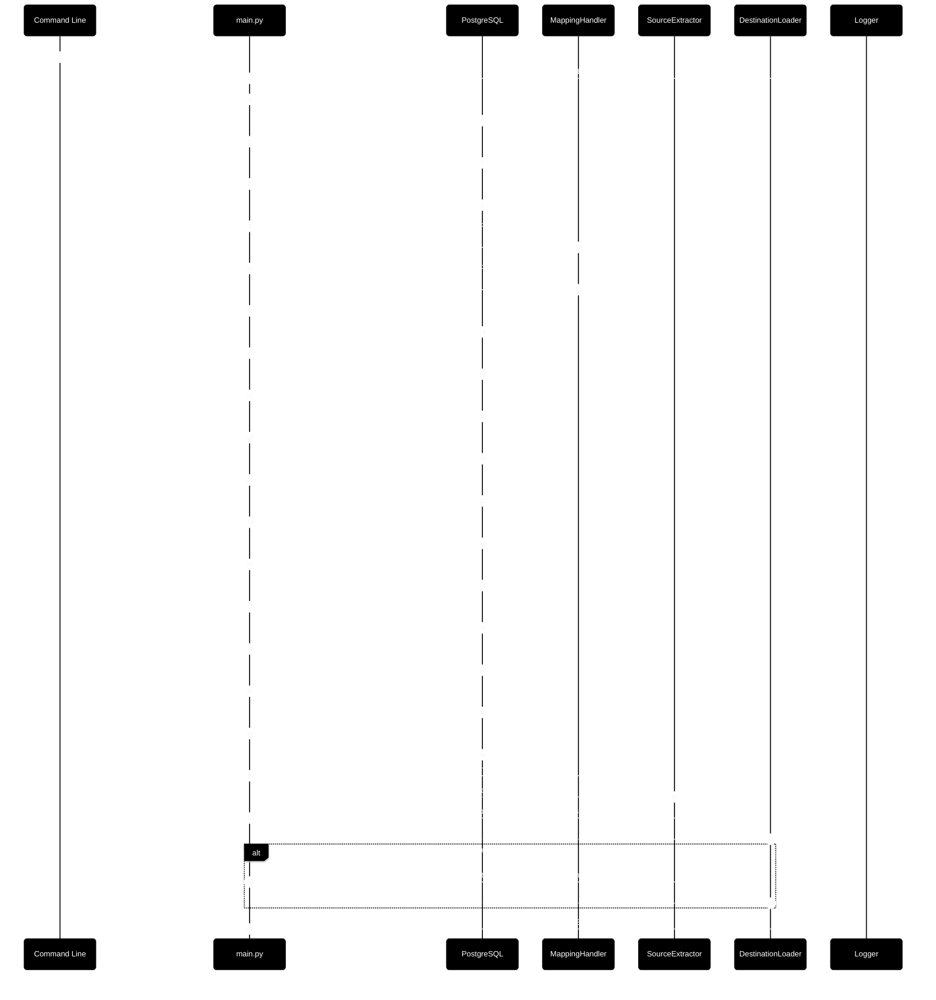

# Cross-Platform ETL Pipeline: SQL Server to PostgreSQL Migration

<div align="center">

[](https://www.python.org/) [](https://learn.microsoft.com/en-us/sql/sql-server/what-s-new-in-sql-server-2022?view=sql-server-ver17) [](https://www.postgresql.org/) [](https://pdm.fming.dev)
</div>

This repository contains a modular ETL orchestration pipeline from SQL Server to  PostgreSQL databases. It automates the full lifecycle of database teardown, schema creation, query mapping generation, data extraction, and data loading into production and test environments.

## 🪄 Overview

The ETL workflow is coordinated through a single entry point (`main.py`) and integrates reusable modules for:

- Dropping and rebuilding PostgreSQL databases and roles
- Generating source and destination query mappings from a CSV file
- Extracting source data using parameterized SQL SELECT queries
- Loading extracted data into destination tables using INSERT queries
- Optionally seeding a test database with the same data

Usage:

```powershell
python3 -m main.py --database aw_sales --seed-test-database False
```

The ETL pipeline processes data across 35 distinct tables, resulting in a total of 485,625 rows extracted, transformed, and loaded into the destination system. The volume reflects a moderately complex schema with substantial row-level operations, suitable for analytics, reporting, or downstream integration.

|Stat|Count|
|---|---|
|Total Number of Tables|35|
|Total Number of Rows|485,625|




## 📦 Packages

| Domain            | Package           | Minimum Version |
|------------------|-------------------|-----------------|
| Database Drivers | psycopg2          | 2.9.10          |
|                  | pyodbc            | 5.2.0           |
| Environment      | python-decouple   | 3.8             |
|                  | python-dotenv     | 1.1.1           |
| CLI Utilities    | argparse          | 1.4.0           |
| Data Processing  | pandas            | 2.3.3           |
| Code Formatting  | black             | 25.9.0          |

## 🧩 Modular Components

Each stage of the pipeline is modular and testable:

- `create_database()`: Creates PostgreSQL databases
- `create_role()`: Creates database roles
- `grant_database_permissions()`: Grants database-level access
- `create_database_schemas()`: Creates schemas
- `create_database_tables()`: Creates tables from SQL files
- `extract_source_data()`: Extracts data from source queries
- `load_destination_tables()`: Loads data into destination tables
- `build_mapping_data()`: Generates query/table mappings from CSV

## 📦 Repository Structure

```text
├── sql/                                   # SQL scripts and mappings
│   ├── source/
│   ├── destination/
│   ├── mapping.csv                        # Source-to-destination table/query mapping
│   ├── mapping_source.json                # Generated source query mappings
│   └── mapping_destination.json           # Generated destination query mappings
├── logs/                                  # Runtime logging
│   └── app.log                            # Application log output
├── src/
│   ├── build/
│   │   └── build_destination_database.py  # PostgreSQL DDL and permission utilities
│   ├── extract/
│   │   └── get_source_data.py            # Source data extraction logic
│   ├── load/
│   │   └── insert_source_data.py         # Destination data insertion logic
│   ├── utils/
│   │   ├── file_handler.py               # JSON and SQL file utilities
│   │   ├── logging_handler.py            # Structured logging
│   │   └── query_mapping_handler.py      # Mapping generation from CSV
│   └── main.py                           # ETL orchestration entry point
```

## ✅ Logging

Structured logging is enabled throughout the pipeline for traceability:

- Success and failure messages for each stage
- Exception handling with stack traces
- Visual markers for pipeline progress

Example: [app.log](./logs/app.log)

## 🤝 Contributing

This project welcomes modular enhancements, teardown logic improvements, and onboarding clarity. Please submit pull requests with:

- Isolated, testable changes
- Updated docstrings and logging
- Contributor-friendly scaffolds

## 📄 License

This repository is licensed under the MIT License. See `LICENSE` for details.
